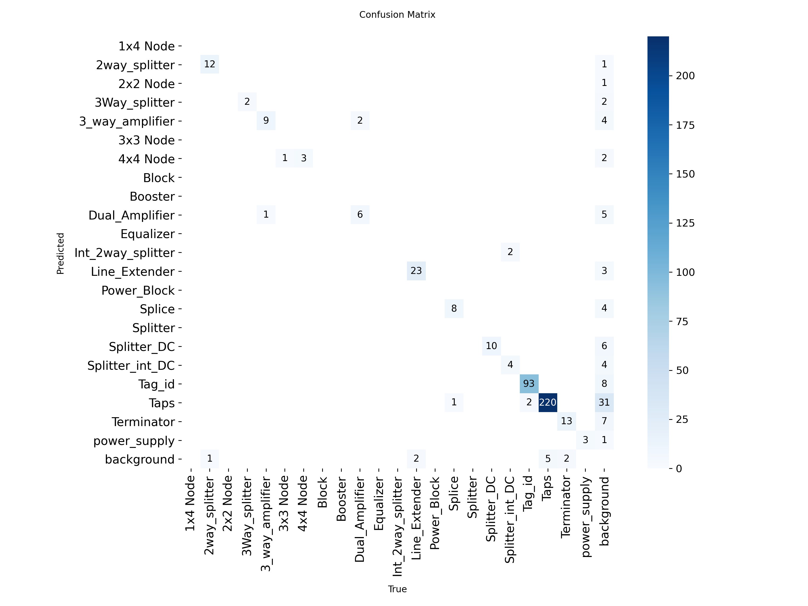
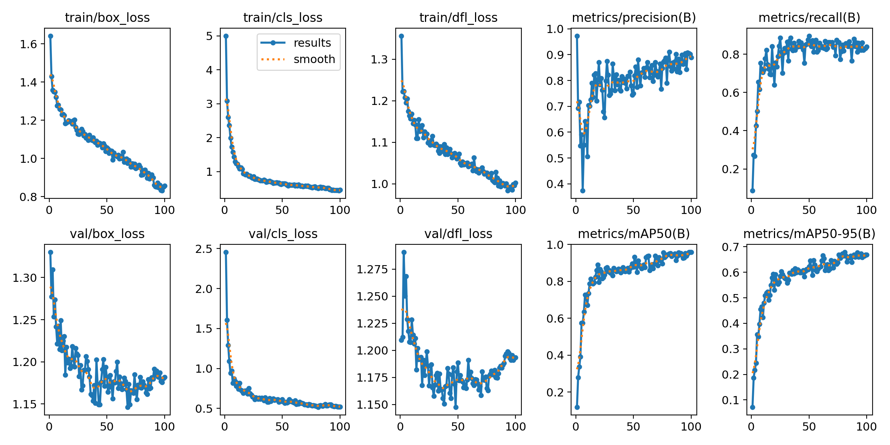
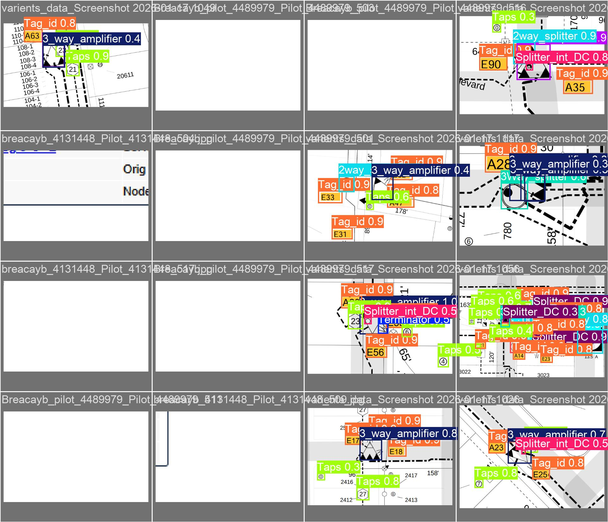
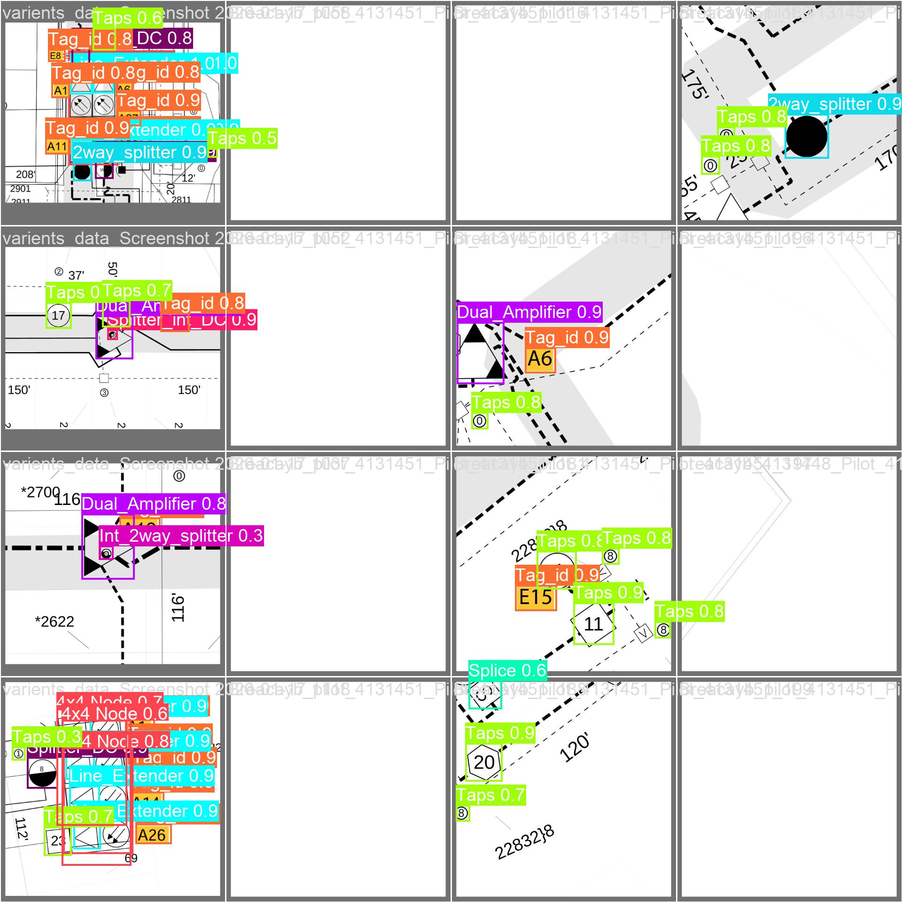
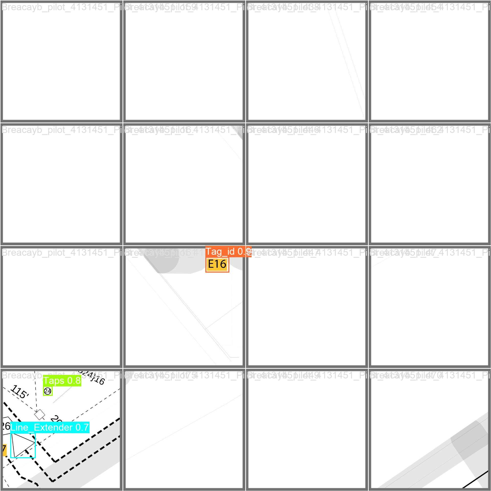

# RF Symbol Detection using YOLOv8

An end-to-end machine learning project built with Ultralytics YOLOv8 to automatically detect and classify telecommunications and RF components (symbols like Taps, Splitters, Nodes, and Amplifiers) from complex circuit map images.

## 🚀 How It Works

This project is an automated AI pipeline that processes mapped annotations, trains a custom object detection algorithm, and outputs bounded predictions.

1. **Data Conversion & Ingestion (`convert_cvat_to_yolo.py`)**: 
   - Reads raw annotations exported from CVAT (Computer Vision Annotation Tool) in XML format.
   - Maps arbitrary string class names into static integer IDs.
   - Normalizes XML coordinates into the YOLO bounding-box format (center_x, center_y, width, height) and splits the data into standardized `train` and `val` structured directories generating the necessary `data.yaml`.
2. **Model Training (`train_yolo.py`)**: 
   - Implements `ultralytics` YOLO framework.
   - Trains dynamically across multiple dataset iterations (pilots, augmentations, variations). 
   - Utilizes hyperparameters like specific `batch` sizing, Early Stopping (`patience`), and customized augmentation logic (`fliplr=0.0`) to avoid confusing direction-sensitive symbols.
3. **Inference/Predictions (`predict.py`)**:
   - Takes unseen raw maps from the `/before` directory.
   - Passes them through the trained model weights (`best.pt`).
   - Outputs newly plotted map images overlaid with confidence scores and symbol bounding boxes into the `inference_results` folder. 

## 🛠️ Technology Stack
- **Python 3.10**: Core programming language.
- **Ultralytics YOLOv8**: State-of-the-Art Object Detection framework (utilizing Nano and Large architectures).
- **PyTorch**: Deep learning backend optimized for Nvidia CUDA (GPU support).
- **OpenCV & Pillow**: High-performance raster image processing for plotting and saving map tiles.
- **Matplotlib & Pandas**: For calculating metric reports, logging CSV data, and exporting PDF performance charts.

---

## 📊 Best Model (v3 - YOLOv8 Nano) Validation Results

Through extensive iterative testing (models v1 through v7 across various datasets and GPU configurations), the **v3 Nano** model successfully achieved an optimal balance. It yielded a massive **95.1% overall accuracy (mAP50)**, providing robust detection on dense, small symbols without overfitting to noise. 

### Performance Metrics & Confusion Matrix

### Validation Predictions
*Below are validation sample batches showing the AI effectively classifying components in real-time:*

  

  

  

